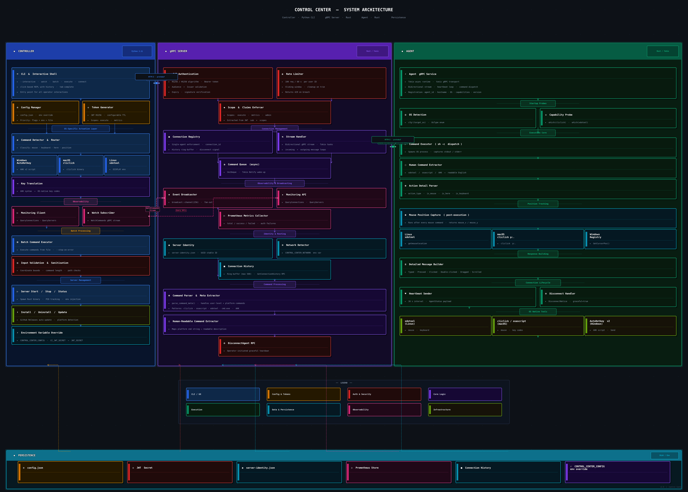

# Control Center - Desktop Actuation Tool

**Version:** 1.2.2  
**Last Updated:** July 2026  
**Developer:** Kartik A (NullVoider)

---

## Table of Contents

1. [Overview](#overview)
2. [Key Features](#key-features)
3. [Capability Summary](#capability-summary)
   - [Server Capabilities](#server-capabilities)
   - [Agent Capabilities](#agent-capabilities)
   - [Controller Capabilities](#controller-capabilities)
4. [Technical Specifications](#technical-specifications)
   - [System Requirements](#system-requirements)
   - [Architecture](#architecture)
   - [Platform Backends](#platform-backends)
5. [Installation](#installation)
6. [Quick Start](#quick-start)
7. [Authentication](#authentication)
   - [JWT Tokens](#jwt-tokens)
   - [Token Scopes](#token-scopes)
   - [Environment Variables](#environment-variables)
8. [Security Model](#security-model)
   - [Transport Security (TLS)](#transport-security-tls)
   - [Structured Commands: No Shell Anywhere](#structured-commands-no-shell-anywhere)
   - [Agent Identity and Stream Binding](#agent-identity-and-stream-binding)
   - [Local Data at Rest](#local-data-at-rest)
   - [Threat Model and Non-Goals](#threat-model-and-non-goals)
9. [Command Syntax Reference](#command-syntax-reference)
   - [Mouse Commands](#mouse-commands)
   - [Keyboard Commands](#keyboard-commands)
   - [Position Tracking](#position-tracking)
   - [Platform Differences](#platform-differences)
10. [Usage Modes](#usage-modes)
    - [Interactive Mode](#interactive-mode)
    - [Single Execute Mode](#single-execute-mode)
    - [Batch Mode](#batch-mode)
    - [Watch Mode](#watch-mode)
11. [CLI Command Reference](#cli-command-reference)
    - [server](#server)
    - [agent](#agent)
    - [connect](#connect)
    - [execute](#execute)
    - [watch](#watch)
    - [batch](#batch)
    - [status](#status)
    - [session](#session)
    - [export](#export)
    - [audit](#audit)
    - [token](#token)
    - [gen-certs](#gen-certs)
    - [config](#config)
    - [version / doctor / update / uninstall](#version--doctor--update--uninstall)
12. [Configuration](#configuration)
13. [Session Management](#session-management)
14. [Metrics and Monitoring](#metrics-and-monitoring)
15. [Export System](#export-system)
16. [Audit Logging](#audit-logging)
17. [WatchCommands Stream](#watchcommands-stream)
18. [Troubleshooting](#troubleshooting)
19. [Deployment Notes](#deployment-notes)
20. [License](#license)
21. [About This Project](#about-this-project)

---

## Overview

**Control Center** is a desktop actuation tool designed for Computer Use Agent (CUA) workflows. It provides real-time mouse, keyboard, and OS-level control over remote machines with a client-server architecture built on gRPC.

Control Center consists of three components:

- **Server** (Rust): High-performance gRPC server that receives, validates, and routes actuation commands to the connected agent
- **Agent** (Rust): Cross-platform actuation client that runs on the target machine, translates commands into native OS actions, and reports results back to the server
- **Controller** (Python): CLI and programmatic interface used to send commands to the server, manage sessions, and observe live command events

### Use Cases

- **CUA Actuation**: Send mouse and keyboard commands to a remote desktop environment controlled by an AI agent
- **Automation Scripting**: Execute sequences of UI interactions from scripts or batch files
- **AI Training Data Collection**: Record command streams with full spatial and timing metadata for training computer use models
- **Remote Desktop Control**: Control a remote machine's UI without a traditional remote desktop client

---

## Key Features

- ✅ **Cross-Platform Actuation**: Windows, macOS, and Linux (X11) support from a single command interface
- ✅ **Three Usage Modes**: Interactive shell, single-command execution, and batch file execution
- ✅ **Line Editing & History**: The interactive console supports readline line editing (arrow-key cursor movement) and up/down command history that persists across `connect` sessions, is cleared when the server restarts, and is encrypted at rest (key in the OS keyring)
- ✅ **Live Command Streaming**: WatchCommands gRPC stream for real-time event observation by external tools
- ✅ **Auto OS Detection**: Server detects connected agent OS and dispatches commands to the correct backend automatically
- ✅ **Position Tracking**: All mouse commands automatically report final cursor coordinates after execution
- ✅ **TLS by Default**: All gRPC traffic is encrypted; the server refuses to start without a certificate unless insecure mode is explicitly requested. `control-center gen-certs` generates local development material
- ✅ **JWT Authentication**: Scope-based token authentication on every RPC that returns data or acts (`Ping` is the sole liveness exception)
- ✅ **Shell-Free Actuation**: Commands travel as a structured argument vector and are executed directly. The agent never invokes a shell, and every argument is validated against an actuation grammar before a process is spawned
- ✅ **Bound Agent Identity**: Agents authenticate with an `agent`-scoped token, and the command stream is bound to the agent that registered it
- ✅ **Session Persistence**: Sessions are saved to disk and accessible after disconnect
- ✅ **Reconnection Logic**: Interactive mode automatically attempts reconnection on connection loss
- ✅ **Batch File Support**: Execute commands from txt, JSON, NDJSON, YAML, or CSV files
- ✅ **Full Export System**: Export command logs, metrics, session data, audit logs, and diagnostics
- ✅ **Structured Audit Logging**: Every auth event, session start/stop, and agent disconnect is logged as structured JSON
- ✅ **VM Shutdown Detection**: Detects and gracefully handles target machine shutdown mid-session
- ✅ **Heartbeat Monitoring**: Server emits heartbeat events every 5 seconds during idle periods to signal liveness

---

## Capability Summary

### Server Capabilities

The Control Center Server is a Rust-based gRPC service that acts as the command broker between the controller and the agent.

**Core Functions:**

- Accepts and validates incoming gRPC commands from the controller
- Proxies validated commands to the connected Rust agent
- Maintains a registry of connected agents with connection metadata
- Enforces JWT-based authentication and scope checks on all privileged RPCs
- Tracks command execution counts, uptime, and connection history
- Broadcasts command events to all active WatchCommands subscribers
- Operates in single-agent mode (default) or multi-agent mode

**gRPC Service Endpoints:**

Every RPC below requires a valid JWT except `Ping`. A token that authenticates but
lacks the listed scope is rejected with `PERMISSION_DENIED`.

| RPC | Required Scope | Description |
|-----|---------------|-------------|
| `ExecuteCommand` | `execute` | Execute a single command on the agent |
| `DisconnectAgent` | `admin` | Send graceful disconnect signal to agent |
| `RegisterAgent` | `agent` | Agent announces itself and receives a connection ID |
| `AgentStream` | `agent` | Bidirectional command stream, bound to the registering agent |
| `GetAgentInfo` | `monitor` | Get agent OS, version, and capability info |
| `QueryConnections` | `monitor` | List currently connected agents |
| `QueryServers` | `monitor` | List server identity and status |
| `GetServerIdentity` | `monitor` | Get server ID, hostname, version, and uptime |
| `GetConnectionHistory` | `monitor` | Retrieve historical connection records |
| `MonitorConnection` | `monitor` | Stream connection-state changes |
| `WatchCommands` | `monitor` | Stream live command events (read-only) |
| `GetMetrics` | `metrics` | Prometheus-style performance metrics |
| `Ping` | none | Round-trip liveness check (returns no data) |
| `Execute` | — | **Retired.** Carried an unstructured shell string; returns `UNIMPLEMENTED`. Use `ExecuteCommand` |

### Agent Capabilities

The Control Center Agent is a Rust binary that runs on the target machine and executes commands using platform-native tools.

**Platform Support:**

| Platform | Mouse Backend | Keyboard Backend |
|----------|--------------|-----------------|
| Windows | AutoHotkey v2 (AHK) | AutoHotkey v2 (AHK) |
| macOS | cliclick | osascript (AppleScript) |
| Linux | xdotool | xdotool |

**Core Functions:**

- Authenticates to the server with an `agent`-scoped JWT and registers its OS type, version, and capabilities
- Connects over TLS, verifying the server against a configured CA
- Receives a structured argument vector per command and executes it directly — no shell is involved at any point
- Validates every argument against an actuation grammar and refuses anything outside it
- Captures mouse position after every mouse action
- Reports execution success/failure, timing, and the argv actually executed with each result
- Sends keepalive signals to maintain server connection
- Detects and reports capabilities available on the host (e.g., `cliclick`, `xdotool`)

### Controller Capabilities

The Python controller provides the CLI and `GRPCClient` class used to interact with the server.

**Core Functions:**

- Connects to the server over TLS by default, trusting a private CA via `CC_TLS_CA`
- Manages JWT authentication and token resolution (flag → env var → config file), reading tokens from a no-echo prompt rather than argv
- Auto-detects agent OS and initializes the appropriate actuation controller
- Translates each human command into a structured argument vector; no shell string is ever constructed
- Provides three command execution modes: interactive, execute, and batch
- Streams live command events from WatchCommands
- Manages session lifecycle and persists session data between runs
- Exports session data, metrics, and audit logs in multiple formats
- Generates, inspects, and validates JWT tokens locally

---

## Technical Specifications

### System Requirements

#### Server

- **OS**: Linux, macOS, or Windows
- **RAM**: 64 MB minimum
- **Network**: TCP port 50051 (default, configurable)
- **Dependencies**: None (standalone Rust binary)
- **Required env**: `JWT_SECRET` (≥64 characters)

#### Agent

- **OS**: Windows 10+, macOS 10.13+, or Linux with X11
- **RAM**: 32 MB minimum
- **Dependencies**:
  - Windows: AutoHotkey v2 must be installed
  - macOS: `cliclick` must be installed (`brew install cliclick`)
  - Linux: `xdotool` must be installed (`apt install xdotool`), `DISPLAY` must be set

#### Controller (CLI)

- **OS**: Windows, macOS, Linux
- **Python**: 3.12 or higher
- **Required Python dependencies**:
  - `grpcio` — gRPC client
  - `grpcio-tools` — proto code generation
  - `click` — CLI framework
  - `PyJWT` — token generation and validation
  - `psutil` — system resource metrics
  - `pyyaml` — YAML batch file support (optional)

### Architecture



#### Data Flow

1. **Command Input**: User types a command in interactive mode, or `execute`/`batch` is called
2. **Actuation Layer**: Python controller translates the human command into a structured argument vector (`argv`) for the target platform, plus the original text as `human_command` for the record
3. **gRPC Call**: `ExecuteCommand` is sent to the server over TLS with `argv` and `human_command`
4. **Validation**: Server verifies the JWT, enforces the `execute` scope, applies the rate limit, and rejects any request that omits `argv`
5. **Dispatch**: Server forwards the command to the connected Rust agent over the bound agent stream
6. **Grammar Check**: Agent validates `argv` against the actuation grammar — the binary, its sub-command, and every argument — and refuses anything outside it
7. **Execution**: Agent spawns the platform backend directly (AHK file-drop / cliclick / osascript / xdotool). No shell is involved
8. **Position Capture**: Agent captures final mouse coordinates after mouse commands
9. **Response**: Result, position, timing, and the argv actually executed are returned up the chain
10. **Broadcast**: Server broadcasts a `CommandEvent` to all `monitor`-scoped WatchCommands subscribers

### Platform Backends

**Windows — AutoHotkey v2**

Commands are written to `C:\mouse_cmd.txt` and `C:\keyboard_cmd.txt` and picked up by a persistent AHK v2 script running on the agent machine. This avoids spawning a new AHK process per command, which gives lower latency. The agent writes these two files directly through the filesystem — the write target is restricted to exactly those two paths.

**macOS — cliclick + osascript**

Mouse commands use `cliclick` (a command-line tool for simulating mouse events). Keyboard commands — including `type` and all modifier+key combinations — use `osascript` with AppleScript's `keystroke` and `key code` commands, each passed as a single argument. Accepted AppleScript is restricted to those two forms; a free-form script is refused.

Scrolling is the one action needing two binaries (a `cliclick` focus click followed by an AppleScript key-repeat loop). It is sent as a bounded `__scroll__` instruction that the agent expands itself, so the two programs run in sequence without a shell and the action is still recorded as a single event.

**Linux — xdotool**

Both mouse and keyboard commands are executed by spawning `xdotool` directly with a validated argument list. The `DISPLAY` environment variable is supplied by the agent. On headless systems, Xvfb can provide a virtual display.

---

## Installation

### macOS and Linux

```bash
curl -fsSL https://raw.githubusercontent.com/nullvoider07/control-center/master/install/install.sh | bash
```

This will:
- Download platform-specific binaries (`control-center`, `control-center-server`, `control-center-agent`)
- Install to `~/.local/bin`
- Install Python package and dependencies
- Update PATH in your shell profile

### Windows

Run in PowerShell (Administrator):

```powershell
irm https://raw.githubusercontent.com/nullvoider07/control-center/master/install/install.ps1 | iex
```

This will:
- Download Windows binaries
- Install to `%LOCALAPPDATA%\Programs\ControlCenter\bin`
- Add to system PATH
- Install Python package

### Windows Agent Setup

Windows actuation requires two AutoHotkey v2 watcher scripts to be installed and running on the target machine before the agent is started. These scripts run as background services and watch for command files written by the Rust agent.

#### Prerequisites

1. **Install AutoHotkey v2** from [https://www.autohotkey.com](https://www.autohotkey.com). The scripts require v2 — v1 is not compatible.

2. **Obtain the AHK scripts.** The two scripts (`mouse_control.ahk` and `keyboard_control.ahk`) are included in the Control Center release package.

#### Step 1: Copy Scripts to AutoHotkey Directory

Open PowerShell as Administrator and run:

```powershell
Copy-Item "mouse_control.ahk" "C:\Program Files\AutoHotkey\mouse_control.ahk"
Copy-Item "keyboard_control.ahk" "C:\Program Files\AutoHotkey\keyboard_control.ahk"
```

The Rust agent writes commands to `C:\mouse_cmd.txt` and `C:\keyboard_cmd.txt`. The watcher scripts poll these files continuously and execute the commands via AutoHotkey v2.

#### Step 2: Configure Auto-Start via Task Scheduler

The watchers must start automatically at login. Use Task Scheduler so they run with the correct user context and elevation level.

**Windows 10:**

```powershell
# Mouse watcher
$MouseArg = '/c start /min "" "C:\Program Files\AutoHotkey\v2\AutoHotkey.exe" "C:\Program Files\AutoHotkey\mouse_control.ahk" watcher'
$ActionMouse = New-ScheduledTaskAction -Execute "cmd.exe" -Argument $MouseArg
$Trigger = New-ScheduledTaskTrigger -AtLogOn -User "AgentUser"
$Settings = New-ScheduledTaskSettingsSet -AllowStartIfOnBatteries -DontStopIfGoingOnBatteries -ExecutionTimeLimit 0 -Hidden
$Principal = New-ScheduledTaskPrincipal -UserId "AgentUser" -LogonType Interactive -RunLevel Highest
Register-ScheduledTask -TaskName "MouseControlWatcher" -Action $ActionMouse -Trigger $Trigger -Settings $Settings -Principal $Principal

# Keyboard watcher
$KeyboardArg = '/c start /min "" "C:\Program Files\AutoHotkey\v2\AutoHotkey.exe" "C:\Program Files\AutoHotkey\keyboard_control.ahk" watcher'
$ActionKey = New-ScheduledTaskAction -Execute "cmd.exe" -Argument $KeyboardArg
$Trigger = New-ScheduledTaskTrigger -AtLogOn -User "AgentUser"
$Settings = New-ScheduledTaskSettingsSet -AllowStartIfOnBatteries -DontStopIfGoingOnBatteries -ExecutionTimeLimit 0 -Hidden
$Principal = New-ScheduledTaskPrincipal -UserId "AgentUser" -LogonType Interactive -RunLevel Highest
Register-ScheduledTask -TaskName "KeyboardControlWatcher" -Action $ActionKey -Trigger $Trigger -Settings $Settings -Principal $Principal
```

Replace `AgentUser` with the actual Windows username that will be logged in when the agent runs.

**Windows 11:**

```powershell
# Mouse watcher
$MouseArg = '/c start /min "" "C:\Program Files\AutoHotkey\v2\AutoHotkey.exe" "C:\Program Files\AutoHotkey\mouse_control.ahk" watcher'
$ActionMouse = New-ScheduledTaskAction -Execute "cmd.exe" -Argument $MouseArg
$CurrentUser = "$env:USERDOMAIN\$env:USERNAME"
$Trigger = New-ScheduledTaskTrigger -AtLogOn -User $CurrentUser
$Settings = New-ScheduledTaskSettingsSet -AllowStartIfOnBatteries -DontStopIfGoingOnBatteries -ExecutionTimeLimit 0 -Hidden
$Principal = New-ScheduledTaskPrincipal -UserId $CurrentUser -LogonType Interactive -RunLevel Highest
Register-ScheduledTask -TaskName "MouseControlWatcher" -Action $ActionMouse -Trigger $Trigger -Settings $Settings -Principal $Principal -Description "Monitors for remote mouse control commands"

# Keyboard watcher
$KeyboardArg = '/c start /min "" "C:\Program Files\AutoHotkey\v2\AutoHotkey.exe" "C:\Program Files\AutoHotkey\keyboard_control.ahk" watcher'
$ActionKey = New-ScheduledTaskAction -Execute "cmd.exe" -Argument $KeyboardArg
$CurrentUser = "$env:USERDOMAIN\$env:USERNAME"
$Trigger = New-ScheduledTaskTrigger -AtLogOn -User $CurrentUser
$Settings = New-ScheduledTaskSettingsSet -AllowStartIfOnBatteries -DontStopIfGoingOnBatteries -ExecutionTimeLimit 0 -Hidden
$Principal = New-ScheduledTaskPrincipal -UserId $CurrentUser -LogonType Interactive -RunLevel Highest
Register-ScheduledTask -TaskName "KeyboardControlWatcher" -Action $ActionKey -Trigger $Trigger -Settings $Settings -Principal $Principal -Description "Monitors for remote keyboard control commands"
```

#### Step 3: Start Watchers Immediately

There is no need to reboot to start the watchers for the first time. Run them directly:

```powershell
Start-ScheduledTask -TaskName "MouseControlWatcher"
Start-ScheduledTask -TaskName "KeyboardControlWatcher"

# Verify both are running — you should see 2 AutoHotkey processes
Get-Process | Where-Object {$_.ProcessName -eq "AutoHotkey"}
```

> **Note:** From the next login onward, the watchers will start automatically at logon via Task Scheduler. A system restart (or manual logoff and logon) is required to verify the auto-start is working correctly. The Control Center agent will not be able to execute mouse or keyboard commands on Windows if the watchers are not running.

#### Step 4: Start the Agent

Once the watchers are confirmed running, start the Control Center agent:

```powershell
control-center agent start --server-host 192.168.1.100
```

---

### Build from Source

```bash
# Clone the repository
git clone https://github.com/nullvoider07/control-center.git
cd control-center

# Build Rust binaries
cargo build --release

# Install Python controller
pip install -e crates/controller
```

---

## Quick Start

### 1. Set JWT Secret

```bash
export CC_JWT_SECRET='your-secret-at-least-64-characters-long'
```

The server refuses to start if the secret is shorter than 32 characters.

### 2. Generate TLS Material

TLS is mandatory. For local development, generate a self-signed CA and server
certificate:

```bash
control-center gen-certs
```

This writes `ca.crt`, `server.crt`, and `server.key` to
`~/.config/control-center/tls/` (keys `0600`) and prints the variables to export.
For production, supply your own certificate instead.

```bash
export CC_TLS_CERT=~/.config/control-center/tls/server.crt   # server
export CC_TLS_KEY=~/.config/control-center/tls/server.key    # server
export CC_TLS_CA=~/.config/control-center/tls/ca.crt         # CLI
```

### 3. Start the Server

```bash
control-center server start
```

### 4. Generate Tokens

The operator and the agent need separate tokens with different scopes:

```bash
# Operator: run commands and read monitoring data
export CONTROL_CENTER_TOKEN=$(control-center token generate --user me --scopes execute monitor)

# Agent: register and serve the command stream, nothing else
control-center token generate --user guest-vm --scopes agent -o agent.token
```

### 5. Start the Agent on the Target Machine

```bash
# On the target machine (or same machine for local testing)
export AGENT_TLS_CA=/path/to/ca.crt
export CONTROL_CENTER_TOKEN=$(cat agent.token)
control-center agent start --server-host 127.0.0.1
```

The agent will not connect without both the CA and an `agent`-scoped token.

### 6. Connect and Start Controlling

```bash
control-center connect --host 127.0.0.1
```

You are now in interactive mode. Type commands to control the desktop:

```
control-center> 960 540 left
control-center> type Hello World
control-center> press ^c
control-center> exit
```

---

## Authentication

### JWT Tokens

Control Center uses JWT (JSON Web Token) for authentication. The server validates a token on every authenticated RPC call. Tokens are signed with HMAC (HS256 by default) using a shared secret.

Tokens contain:
- `sub` — the user identifier
- `scopes` — list of permitted operations
- `exp` — expiry timestamp (required; tokens without expiry are rejected)
- `aud` — audience claim (default: `control-center`)
- `iss` — issuer claim (default: `control-center-auth`)
- `jti` — unique token ID

The controller resolves the token in this priority order: `--token` flag → `CONTROL_CENTER_TOKEN` env var → config file.

### Token Scopes

| Scope | Permitted RPCs | Typically held by |
|-------|---------------|-------------------|
| `execute` | `ExecuteCommand` | Operators and automation drivers |
| `monitor` | `GetAgentInfo`, `QueryConnections`, `QueryServers`, `GetServerIdentity`, `GetConnectionHistory`, `MonitorConnection`, `WatchCommands` | Operators, dashboards, recording consumers |
| `admin` | `DisconnectAgent` | Administrators only |
| `agent` | `RegisterAgent`, `AgentStream` | The agent binary only — never an operator |
| `metrics` | `GetMetrics` | Scrapers such as Prometheus |

Scopes are additive: an operator token is normally minted with `execute monitor`.
Grant `admin` separately and sparingly, since it can forcibly disconnect a live agent.

Every RPC other than `Ping` requires a token, and a token lacking the required scope
is rejected with `PERMISSION_DENIED` even though it authenticated successfully. The
`agent` scope is deliberately disjoint from the operator scopes: an agent token cannot
issue commands, and an operator token cannot impersonate an agent.

**A note on the `monitor` scope:** the `WatchCommands` stream carries `raw_command`,
which includes text typed into the guest. Treat a `monitor` token as sensitive and
issue it only to consumers that are entitled to see keystroke content.

### Environment Variables

| Variable | Used By | Description |
|----------|---------|-------------|
| `CC_JWT_SECRET` | Controller + Server | JWT signing secret (controller maps this to `JWT_SECRET` for the server) |
| `JWT_SECRET` | Server binary | JWT secret as read directly by the Rust server |
| `JWT_AUDIENCE` | Controller + Server | JWT audience claim (default: `control-center`) |
| `JWT_ISSUER` | Controller | JWT issuer claim (default: `control-center-auth`) |
| `CONTROL_CENTER_TOKEN` | Controller + Agent | API token. For the agent this must carry the `agent` scope |
| `AGENT_SERVER_HOST` | Agent binary | Server host the agent connects to |
| `AGENT_SERVER_PORT` | Agent binary | Server port the agent connects to |
| `SERVER_ADDR` | Server binary | Bind address for the server (e.g., `0.0.0.0:50051`) |
| `SINGLE_AGENT_MODE` | Server binary | `true` = only one agent allowed (default), `false` = multi-agent |
| `CONTROL_CENTER_NETWORK` | Server binary | Network label for this server instance |
| `CC_REVOKED_SUBJECTS` | Server binary | Comma-separated JWT subjects to refuse, whatever their signature or expiry. Read at startup |
| `CC_ALLOW_AGENT_TAKEOVER` | Server binary | `true` lets a different principal displace a connected, responding agent. Off by default |
| `RUST_LOG` | Agent + Server | Log level for Rust binaries (e.g., `info`, `debug`) |

**Token lifetime and revocation.** A signed token cannot be withdrawn, so
`generate-token` caps `duration_hours` at 8760 (365 days) — issue a short one and
re-issue rather than minting a long-lived credential. To withdraw a token before it
expires, add its subject to `CC_REVOKED_SUBJECTS` and restart the server; this leaves
every other token working, unlike rotating `JWT_SECRET`, which also invalidates the
token baked into the guest image.

**Agent takeover.** In single-agent mode an agent re-registering takes its slot back,
which is how it recovers from a crash. A *different* principal may only take the slot
once the incumbent has stopped serving it — no heartbeat for 90 seconds, or
registered without ever attaching a command stream. Otherwise registration is refused,
because taking the slot means receiving every subsequent command, `type` payloads
included. Set `CC_ALLOW_AGENT_TAKEOVER=true` for a deliberate hand-off between guests
holding different agent credentials.

**TLS variables:**

| Variable | Used By | Description |
|----------|---------|-------------|
| `CC_TLS_CERT` | Server binary | Path to the server certificate (PEM). Required unless `CC_ALLOW_INSECURE` |
| `CC_TLS_KEY` | Server binary | Path to the server private key (PEM). Required unless `CC_ALLOW_INSECURE` |
| `CC_TLS_CA` | Controller | CA certificate used to verify the server. Omit to use system roots; if set but unreadable the connection fails rather than falling back |
| `CC_TLS_SERVER_NAME` | Controller | Override the name verified against the certificate (for connecting by IP to a DNS-SAN cert) |
| `AGENT_TLS_CA` | Agent binary | CA certificate the agent uses to verify the server |
| `CC_ALLOW_INSECURE` | Controller + Server | `true` disables TLS. **Development only** |
| `AGENT_ALLOW_INSECURE` | Agent binary | `true` lets the agent connect without TLS. **Development only** |

Both insecure switches exist so a local loop can be run without certificates. They are
off by default, and the server refuses to start rather than silently downgrading: if
`CC_TLS_CERT`/`CC_TLS_KEY` are unset and `CC_ALLOW_INSECURE` is not `true`, startup
fails with an explanatory error.

**Setting `RUST_LOG=debug` causes the agent and server to log `human_command`, which
for a `type` command contains the typed text.** Avoid debug logging during sessions
where credentials are entered.

---

## Security Model

Control Center grants remote keyboard and mouse control over a desktop, so the
security boundary that matters is this: **a token that can actuate must be able to
actuate and nothing else.** The design below exists to hold that line.

### Transport Security (TLS)

All gRPC traffic — commands, tokens, and the live command stream — is carried over
one-way TLS. The server presents a certificate; controllers and agents verify it
against a configured CA.

- The server **refuses to start** without `CC_TLS_CERT`/`CC_TLS_KEY` unless
  `CC_ALLOW_INSECURE=true` is set explicitly. There is no silent fallback to plaintext.
- The agent **refuses to connect** without `AGENT_TLS_CA` unless
  `AGENT_ALLOW_INSECURE=true` is set explicitly.
- The CLI defaults to TLS; `CC_ALLOW_INSECURE` opts out for local development.
- `control-center gen-certs` produces a self-signed CA and server certificate
  (RSA-4096, SHA-256, SANs for `localhost`, the loopback addresses, and this host)
  for development. Use real certificates in production.

Client certificates (mutual TLS) are **not** implemented. Callers are identified by
JWT, not by certificate.

### Structured Commands: No Shell Anywhere

Actuation commands are transmitted as a structured argument vector, never as a shell
string, and **the agent invokes no shell at any point**. This is enforced at three
independent layers:

1. **The controller** builds an `argv` list. Typed text becomes a single list element,
   so quoting and escaping never enter the picture.
2. **The server** rejects any `ExecuteCommand` without `argv`. The legacy
   `CommandRequest.command` shell-string field and the old `Execute` RPC are refused
   outright, so no request can reach an interpreter.
3. **The agent** validates `argv` against a deny-by-default actuation grammar before
   spawning anything, then executes the binary directly.

The grammar constrains far more than the program name, because several actuation
binaries can launch other programs if handed arbitrary arguments:

| Binary | What is accepted |
|--------|------------------|
| `xdotool` | Only the sub-commands `type`, `key`, `click`, `mousemove`, `mousedown`, `mouseup`, `getmouselocation`, with per-sub-command argument shapes. `exec`, `spawn`, and `behave` have no accepting branch |
| `cliclick` | Only `prefix:value` action tokens from a fixed prefix set, so no option flags can be passed |
| `osascript` | Only `-e` pairs whose script matches one of two anchored templates (`keystroke "<literal>"` and `key code <n> [using {…}]`). Free-form scripts, and therefore `do shell script`, are refused |
| `__write__` | Writes only to `C:\keyboard_cmd.txt` or `C:\mouse_cmd.txt` (Windows AHK input files). The **destination** is constrained; the **content** is not — see below |
| `__scroll__` | A bounded scroll instruction the agent expands into a fixed cliclick + AppleScript sequence |

Three subtleties worth knowing, because they are easy to get wrong:

- **`__write__` constrains where, not what.** Unlike the other rows, the file content
  is passed through unvalidated. `keyboard_control.ahk` reads it, splits at the first
  space and dispatches `type` to `SendText` and `press` to `Send`, so the content can
  express any keystroke — which is exactly what an `execute`-scoped token already
  authorises through the ordinary grammar. It is not a privilege gain, and it is
  deliberately not validated twice; it is called out because the row above reads like
  the content is checked, and it is not.

- **Typed text is data, never syntax.** A payload such as
  `type hello$(id)` is typed literally — there is no interpreter for it to reach.
- **An allow-listed binary's own option parser is part of the attack surface.**
  `xdotool type` parses options with `getopt_long`, so a payload in `--opt=value` form
  is read as an option even though it is a single argument — and `--file=PATH` would
  type the contents of that file. The agent therefore inserts a `--` terminator before
  the payload, so it is always treated as text. Any binary added to the grammar in
  future needs the same review of its full option list.

Caller-supplied waits and delays are bounded (60 s) so a single command cannot stall
actuation.

### Agent Identity and Stream Binding

Agents are authenticated, not merely accepted:

- `RegisterAgent` requires a JWT carrying the `agent` scope; the registering subject
  is recorded on the connection.
- `AgentStream` requires the same scope **and** is bound to the subject that
  registered. A different `agent`-token holder cannot attach to a live connection, and
  a connection that already has a stream cannot acquire a second one.

This matters because the command stream carries the operator's typed text and its
responses become the recorded command history. Without binding, any holder of any
`agent`-scoped token could attach a second handler, race the shared command queue,
read keystrokes, and return forged results.

Because the agent token is typically baked into a guest image, treat it as a
credential that will eventually leak: scope it to `agent` only, and rotate it when the
image is redistributed.

### Local Data at Rest

- **Command history** persists across `connect` sessions and is cleared when the
  server restarts. It is encrypted with Fernet using a key held in the OS keyring. If
  no keyring backend is available it stays in memory for that session rather than
  being written under weaker protection.
- **`type` commands are not kept across sessions.** readline still recalls them for
  the sitting that produced them, but they are never written to the persistent
  store. Encryption at rest defends against another user on the machine; it does
  nothing about the next person at the same terminal pressing Up, which on a shared
  capture machine is the likelier exposure.
- **Recorded metrics hold the redacted form.** A `type` payload is replaced by its
  character count before it reaches `command_history`, so it is absent from the
  session data file and from every `export` that derives from it.
- **Session, export, and token files** are written owner-only (`0600`, in `0700`
  directories). This includes the four exports that delegate their write to the
  exporter — `commands`, `audit`, `diagnostics` and `report` — which produce the
  command log, audit events and a config snapshot.
- **Tokens are never passed on the command line.** `token inspect`, `token validate`,
  and `config set-token` read from a no-echo prompt when the argument is omitted,
  because argv is visible in the process list and shell history. Passing one anyway
  prints a warning.

### Threat Model and Non-Goals

**Defended against:**

- Network eavesdropping and tampering on the command path (TLS)
- An unauthenticated party issuing commands, reading the command stream, or
  impersonating an agent (JWT + scopes + stream binding)
- Privilege escalation from actuation to arbitrary code execution on the guest
  (structured argv, grammar validation, no shell)
- A narrow token reading data it was not granted (per-RPC scope checks)
- Credential exposure through argv, shell history, or world-readable local files

**Explicitly not defended against:**

- **A compromised operator with `execute` scope.** Keyboard control is inherently
  powerful: anyone who can synthesise keystrokes can drive whatever the desktop
  session can do, including opening a terminal. The grammar prevents the *agent
  process* from being turned into a shell; it cannot prevent a legitimate keystroke
  stream from being used maliciously. Scope tokens tightly and keep the audit log.
- **A compromised guest.** An agent host under attacker control can report whatever it
  likes; the server trusts a registered, authenticated agent's responses.
- **Denial of service.** Rate limiting (100 requests/60 s per token subject) blunts
  casual abuse, but the single-agent model means a determined authorised caller can
  monopolise actuation.
- **Client certificates / mutual TLS.** Not implemented; identity comes from JWT.
- **Secrets in the corpus.** The recording path stores `raw_command` by design. If
  credentials are typed during a recorded session, they are in the recording.

---

## Command Syntax Reference

The actuation command language is the same across all three platforms. The controller translates these commands into the appropriate OS-specific calls before sending them to the server.

### Mouse Commands

| Command | Description |
|---------|-------------|
| `<x> <y> move` | Move cursor to coordinates without clicking |
| `<x> <y> left` | Move to coordinates and left-click |
| `<x> <y> right` | Move to coordinates and right-click |
| `<x> <y> double` | Move to coordinates and double-click |
| `<x> <y> middle` | Move to coordinates and middle-click |
| `<x> <y> triple` | Move to coordinates and triple-click (macOS only) |
| `<x> <y> scroll_up [n]` | Move to coordinates and scroll up (optionally n times) |
| `<x> <y> scroll_down [n]` | Move to coordinates and scroll down (optionally n times) |
| `<x> <y> drag <x2> <y2>` | Click and drag from (x,y) to (x2,y2) |
| `<x> <y> drag <x2> <y2> dwell <ms>` | macOS: same, with a custom pause after the press and each move (1–5000 ms, default 50) |
| `<x> <y> drag via <ax> <ay> [via …] to <x2> <y2>` | macOS: drag along a path (up to 16 waypoints) |
| `here <action>` | Perform action at the current cursor position |
| `position` | Query and return the current mouse cursor position |

The default single-hop drag with its 50 ms dwells is enough for a selection drag,
but drag-and-drop targets and some overlay UIs only track a slower or multi-step
movement. Both extended forms stay **one recorded step**. They are implemented for
the macOS backend; Linux and Windows accept the plain `drag <x2> <y2>` form only.

On macOS the moves between the press and the release are emitted as `cliclick dm:`
(drag-continuation), not `m:`. `m:` posts `mouseMoved` and only `dm:` posts
`leftMouseDragged`, which is the event a target tracking a drag listens for — with
`m:` the target saw a press, a run of unrelated pointer motion and a release, so a
⇧⌘4 selection drag reported success while drawing no rectangle and writing no file.
The agent's argv grammar accepts `dm:` for the same reason, so **the controller and
the agent have to be upgraded together**: an older agent refuses the token outright
with `cliclick: invalid action token`.

**Examples:**

```
960 540 left            → Left-click at screen center
1200 300 right          → Right-click at (1200, 300)
500 400 double          → Double-click at (500, 400)
100 100 drag 800 600    → Drag from (100,100) to (800,600)
100 100 drag 800 600 dwell 150
                        → Same drag, 150 ms pauses (slower, for finicky targets)
100 100 drag via 400 300 via 700 500 to 900 700
                        → Drag along a path through two waypoints
here left               → Left-click at wherever cursor currently is
960 540 scroll_down 5   → Scroll down 5 notches at center
position                → Return current X and Y coordinates
```

### Keyboard Commands

| Command | Description |
|---------|-------------|
| `type <text>` | Type the given text literally |
| `press <keys>` | Press one or more keys or a shortcut |
| `{Enter}` | Press the Enter key (auto-detected without `press`) |
| `{Tab}` | Press the Tab key |
| `{Esc}` or `{Escape}` | Press the Escape key |
| `{Backspace}` or `{BS}` | Press Backspace |
| `{Delete}` or `{Del}` | Press Delete (forward delete) |
| `{Up}`, `{Down}`, `{Left}`, `{Right}` | Arrow keys |
| `{Home}`, `{End}` | Home / End keys |
| `{PgUp}`, `{PgDn}` | Page Up / Page Down |
| `{F1}` – `{F12}` | Function keys |
| `{Space}` | Space key |
| `{Plus}` | The plus key — see the note on `+` below |
| `{code:N}` | Press macOS virtual keycode N (0–127) directly — see below |

**Modifier syntax** (same across all platforms):

| Symbol | Modifier |
|--------|---------|
| `^` | Ctrl |
| `+` | Shift |
| `!` | Alt / Option |
| `#` | Super / Win / Cmd |

A modifier symbol is only read as a modifier in the **prefix** position, so
punctuation after the prefix is an ordinary target key: `press ^-` is Ctrl+Minus.
The one exception is `+`, which is always the Shift modifier — `press ^+` is
Ctrl+Shift, and Ctrl+Plus must be written **`press ^{Plus}`**.

Punctuation targets are supported on every platform. On Linux they are translated
to X keysym names before reaching `xdotool`, which cannot resolve raw characters:
`press ^,` is sent as `ctrl+comma`, not `ctrl+,`.

**Examples:**

```
type Hello World        → Types the string "Hello World"
press ^c                → Ctrl+C (Copy)
press ^v                → Ctrl+V (Paste)
press ^z                → Ctrl+Z (Undo)
press ^a                → Ctrl+A (Select All)
{Enter}                 → Press Enter
press +{Tab}            → Shift+Tab
press ^!{Delete}        → Ctrl+Alt+Delete
press ^+{Esc}           → Ctrl+Shift+Esc (Task Manager on Windows)
#                       → Super key (opens Start / app launcher)
#r                      → Super+R (Run dialog on Windows/Linux)
press ^-                → Ctrl+Minus (zoom out)
press ^{Plus}           → Ctrl+Plus (zoom in)
press ^,                → Ctrl+Comma (preferences)
press ^/                → Ctrl+Slash (toggle comment)
press ^[                → Ctrl+[ (outdent)
press #+4               → Cmd+Shift+4 (macOS region screenshot)
press #+{code:21}       → Same, addressed by virtual keycode
```

**macOS: modified digits and punctuation.** `cliclick`'s text primitive synthesizes a
character event rather than a keycode carrying modifier flags, and macOS system
hotkeys match on keycode + flags. Shortcuts such as ⇧⌘3/⇧⌘4/⇧⌘5 therefore reported
success and did nothing. The controller now routes any **modified** digit or
punctuation key through an AppleScript `key code`, using a US-ANSI layout map.
Letters are unaffected and still take the original path.

**macOS: modified named keys.** The same rule applies to Space, Escape and F1–F16.
`cliclick` reaches these with `kd:<mod> kp:<key> ku:<mod>` — three independent
events, where the key event carries no modifier flags of its own and depends on the
system having already applied the modifier keydown. The two can disagree, so the
hotkey fires only some of the time: ⌘Space opened Spotlight intermittently, and when
it did not, that keystroke and every step after it landed in whatever was frontmost.
These now go through `key code N using {…}`, which carries the modifiers on the event
itself. Unmodified named keys keep the `kp:` path, and the media keys stay there
permanently — they are system-defined events with no virtual keycode.

**Escape hatch.** That map is finite; `{code:N}` sends a virtual keycode directly, so
a key it does not cover is a console command rather than a release. It composes with
the normal modifier prefix — `press #+{code:21}` is ⇧⌘4. Values outside 0–127 are
rejected rather than typed as text.

### Unrecognised Commands

By default an input matching no known verb is **rejected** rather than typed:

```
control-center> 1022 343left
[✗] Unrecognised command: '1022 343left'
    Did you mean: 1022 343 left
    To type it literally: type 1022 343left
    Pass --lenient to restore the old behaviour of typing unknown input.
```

`type <text>` is the only way to send text. This matters when a session is being
recorded: the old fall-through typed the mistyped line into whatever had focus and
stored it as a real step, so a dropped space became a spurious entry in the trace
that had to be removed afterwards with everything renumbered.

`--lenient` on `connect`, `execute` and `batch` restores the fall-through.
`session-replay` always runs lenient, so it can reproduce a recording verbatim.

**macOS Unicode modifier syntax** (also accepted):

```
⌘c                      → Cmd+C
⌃v                      → Ctrl+V
⇧{Tab}                  → Shift+Tab
⌥{Up}                   → Option+Up
```

**macOS media keys** (via cliclick kp:):

```
press {VolumeUp}
press {VolumeDown}
press {Mute}
press {BrightnessUp}
press {PlayPause}
```

### Position Tracking

Every mouse command automatically captures and reports the final cursor position after execution. You do not need to do anything extra — the output is returned with the command result:

```
[MOUSE] Left-clicked @(960,540) (42ms)
[MOUSE] Dragged to @(800,600) (118ms)
[MOUSE] Scrolled down at @(500,400) (23ms)
```

To explicitly query the position without performing an action:

```
control-center> position
Position: X=960, Y=540
```

**A reported coordinate is a verified one.** The agent reads the cursor back after
actuating and compares it against the coordinate the command asked for. If they
disagree it re-reads a few times, and if they still disagree it reports
`position_captured: false` and no coordinate rather than a number it could not
confirm. A bare readback cannot distinguish a good read from one that raced the
synthetic event, or from a warp that silently did nothing — and that same value is
both the signal used to gate the next step and the coordinate stored in a recording.

Commands that name no coordinate (`here left`, `position`) have nothing to verify
against and report their plain readback.

> ⚠️ **Consumers must read `position_captured` first.** `mouse_x`/`mouse_y` are
> non-optional integers, so an uncaptured position is carried as `(0, 0)` — itself a
> valid screen coordinate. Without checking the flag, "the cursor was at the origin"
> and "no position was captured" are indistinguishable.

### Held Mouse Buttons

`<x> <y> hold` presses a button and leaves it down until a matching `release`. The
agent tracks outstanding holds and:

- reports them on every subsequent command, so the console can warn once a button has
  been down longer than a few seconds;
- surfaces them on `position`, so a status check answers "is anything held";
- releases them automatically when the agent exits — on `Ctrl+C`, on `SIGTERM`, and
  when the server closes the stream.

```
control-center> 900 700 hold
control-center> 400 300 move
[!] left button still held at (900, 700) for 7s — issue `900 700 release`
```

A hold is never released on a timer: a long press is legitimate during a slow drag.
The automatic release at shutdown is the one action the agent takes without being
asked; it applies only to buttons it recorded going down, and it is logged at `warn`
because it happens after the command stream has closed and therefore cannot appear in
a recording.

### Platform Differences

| Feature | Windows | macOS | Linux |
|---------|---------|-------|-------|
| Mouse backend | AHK v2 | cliclick | xdotool |
| Keyboard backend | AHK v2 | osascript | xdotool |
| Triple-click | ❌ | ✅ | ❌ |
| Media keys | ✅ | ✅ | ❌ |
| Super key (`#`) | Win key | Cmd | Super |
| `{LWin}`, `{RWin}` | ✅ | ❌ | ❌ |
| Unicode modifier chars (⌘ ⌃ ⇧ ⌥) | ❌ | ✅ | ❌ |
| Requires display | ❌ | ❌ | ✅ (DISPLAY) |

---

## Usage Modes

### Interactive Mode

The default and most powerful mode. A persistent gRPC connection is established once and maintained for the duration of the session. Commands are entered one at a time at the `control-center>` prompt.

```bash
control-center connect --host 192.168.1.100 --token YOUR_TOKEN
```

**Interactive mode features:**

- Persistent connection — no per-command connection overhead
- Line editing: move the cursor with the left/right arrow keys and edit the current line (readline-backed; on Windows the native console provides editing)
- Command history: recall previous commands with the up/down arrow keys. History **persists across `connect` sessions** and is cleared when the **server restarts** (it is keyed to the server's process-start time). It is **encrypted at rest** — stored under `~/.config/control-center/history/` with a key held in your OS keyring (0600), capped at ~5000 entries, and it survives `clear`. When no keyring backend is available it falls back to in-memory-only for that session
- Live reconnection: if the connection drops, the session automatically attempts to reconnect (up to the configured retry limit)
- VM shutdown detection: if the target machine powers off, the session is gracefully terminated with a clear notification
- Agent-disconnect detection: if the agent disconnects while you are idle at the prompt, the session is terminated promptly without needing a keypress
- Built-in commands: `help`, `status`, `clear`, `exit`, `quit`
- Session tracking: all commands, their results, and timing are recorded in memory and saved on exit

**Interactive mode built-in commands:**

| Command | Description |
|---------|-------------|
| `help` | Display the OS-specific command reference |
| `status` | Show live connection status, session stats, and system resources |
| `clear` | Clear the terminal |
| `exit` / `quit` / `q` | Disconnect and exit |

### Single Execute Mode

Connect, run one command, then immediately disconnect. Suitable for scripting.

```bash
control-center execute --host 192.168.1.100 --token YOUR_TOKEN -c "960 540 left"
control-center execute -c "type Hello World"   # Uses saved config
control-center execute -c "press ^a"
```

Exit codes: `0` = success, `1` = command failed, `2` = cannot connect to VM/container.

### Batch Mode

Execute a list of commands from a file. The server connection is established once for the entire batch.

```bash
control-center batch -f commands.txt
control-center batch -f commands.json --stop-on-error
control-center batch -f script.yaml --delay 0.5 -o results.json
```

**Supported file formats:**

| Format | Description |
|--------|-------------|
| `txt` | One command per line. Lines starting with `#` are ignored. |
| `json` | A JSON array of strings, or array of `{"command": "..."}` objects |
| `ndjson` | One `{"command": "..."}` JSON object per line |
| `yaml` | A YAML list of command strings (requires `pyyaml`) |
| `csv` | First column is the command. Header row is skipped if the first cell is `command`, `cmd`, or `commands` |

Format is auto-detected from the file extension when `--format auto` (default).

**Example `commands.txt`:**

```
# Click the start menu
960 50 left
# Open search
type notepad
{Enter}
# Wait and type
type Hello from batch mode
press ^s
```

**Example `commands.json`:**

```json
[
  "960 540 left",
  {"command": "type Hello World"},
  "press ^s"
]
```

Results can be saved to a JSON file with `--output results.json`:

```json
{
  "total": 3,
  "success": 3,
  "failed": 0,
  "results": [
    {"index": 1, "command": "960 540 left", "success": true, "error": null},
    {"index": 2, "command": "type Hello World", "success": true, "error": null}
  ]
}
```

### Watch Mode

Stream live command events from the server in real-time. No authentication required. The stream remains open until the agent disconnects or you press Ctrl+C.

```bash
control-center watch                        # Human-readable output
control-center watch --fmt json             # Machine-readable JSON
control-center watch --host 192.168.1.10
```

**Text output format:**

```
[✓] 2026-02-25T12:58:04.286Z | mouse:left | 960 540 left | 42ms
[✗] 2026-02-25T12:58:05.100Z | keyboard:type | type badcommand | 3ms | ERROR: execution failed
[heartbeat] 2026-02-25T12:58:10.000Z — agent alive (session: abc123)
```

**JSON output format** (one JSON object per line):

```json
{"session_id": "abc123", "agent_id": "...", "timestamp": "2026-02-25T12:58:04.286Z", "raw_command": "960 540 left", "action_type": "mouse", "action_subtype": "left", "success": true, "execution_time_ms": 42, "mouse_x": 960, "mouse_y": 540, "is_heartbeat": false, ...}
```

---

## CLI Command Reference

### server

Manage the Control Center server (Rust binary).

```bash
control-center server start [OPTIONS]
```

| Option | Default | Description |
|--------|---------|-------------|
| `--host` | `0.0.0.0` | Interface to bind to |
| `--port` | `50051` | gRPC port |
| `--single-agent` / `--multi-agent` | single | Allow one or multiple agents |
| `--network` | — | Network label for this server instance |
| `--auth-url` | — | OAuth2 authorization URL |
| `--token-url` | — | OAuth2 token URL |
| `--client-id` | — | OAuth2 client ID |

**Examples:**

```bash
control-center server start
control-center server start --port 8080
control-center server start --multi-agent --network datacenter-east
```

**Requires:** `CC_JWT_SECRET` (or `JWT_SECRET`) environment variable set before starting.

---

### agent

Query and manage agents connected to the server.

```bash
control-center agent <subcommand>
```

#### agent info

Show details of the currently connected agent.

```bash
control-center agent info [--host HOST] [--port PORT] [--format text|json]
```

Displays agent ID, hostname, IP, OS type and version, connection ID, connected-at timestamp, and total commands executed.

#### agent capabilities

List the command types supported by the connected agent.

```bash
control-center agent capabilities [--host HOST] [--port PORT] [--format text|json]
```

#### agent ping

Measure round-trip latency to the server.

```bash
control-center agent ping [--host HOST] [--port PORT] [--count N] [--format text|json]
```

Sends N pings (default: 3) and reports per-ping RTT and aggregate min/avg/max.

#### agent disconnect

Send a graceful disconnect signal to the connected agent.

```bash
control-center agent disconnect --token TOKEN [--reason REASON] [--yes]
```

Requires `admin` scope. Prompts for confirmation unless `--yes` is passed.

#### agent history

Show historical connection records from the server registry.

```bash
control-center agent history [--host HOST] [--port PORT] [--limit N] [--format text|json|csv]
```

Returns up to N records (default: 10, server-side max: 500) including connection ID, hostname, IP, OS, connected/disconnected timestamps, commands executed, and disconnect reason.

#### agent start

Launch the Rust agent binary on the current machine.

```bash
control-center agent start [--server-host HOST] [--server-port PORT] [--token TOKEN]
```

| Option | Default | Description |
|--------|---------|-------------|
| `--server-host` | `127.0.0.1` | Server host to connect to |
| `--server-port` | `50051` | Server gRPC port |
| `--token` | env/config | Authentication token |

---

### connect

Connect to the server and enter interactive mode with a persistent connection.

```bash
control-center connect [--host HOST] [--port PORT] [--token TOKEN] [--ssl]
```

Token resolution order: `--token` flag → `CONTROL_CENTER_TOKEN` env var → config file.

On successful connection, a banner is displayed showing the connected OS, agent version, and the available interactive commands. The session is automatically saved on exit.

**Connection failure behavior:** If the connection times out (default 5s), a troubleshooting message is shown. If the connection drops mid-session, the CLI attempts automatic reconnection. If the VM/container has shut down (detected after 3 consecutive failures), the session terminates with a VM shutdown notice.

---

### execute

Execute a single command without a persistent connection.

```bash
control-center execute --command|-c "COMMAND" [--host HOST] [--port PORT] [--token TOKEN] [--ssl]
```

**Examples:**

```bash
control-center execute -c "960 540 left"
control-center execute --host 10.0.0.5 --token $TOKEN -c "type Hello"
control-center execute -c "{Enter}"
```

---

### watch

Stream live command events from the server. No token required.

```bash
control-center watch [--host HOST] [--port PORT] [--ssl] [--fmt text|json]
```

Press Ctrl+C to stop watching. The stream ends automatically when the agent disconnects.

---

### batch

Execute commands from a file.

```bash
control-center batch -f FILE [OPTIONS]
```

| Option | Default | Description |
|--------|---------|-------------|
| `-f`, `--file` | required | Input file path |
| `--format` | `auto` | File format: `auto`, `txt`, `json`, `ndjson`, `yaml`, `csv` |
| `--delay` | `0.0` | Seconds to wait between commands |
| `--stop-on-error` | off | Stop on first failure |
| `-o`, `--output` | — | Write results to a JSON file |
| `--host` | config | Server host |
| `--port` | config | Server port |
| `--token` | env/config | Auth token |
| `--ssl` | off | Use SSL/TLS |

---

### status

Show connection and server status. Can be run bare for a combined overview, or with a subcommand for focused output.

```bash
control-center status [--host HOST] [--port PORT] [--format text|json]
control-center status connection
control-center status server
control-center status metrics
control-center status system
control-center status session
```

| Subcommand | Auth | Description |
|------------|------|-------------|
| *(bare)* | No | Combined live overview: server, connection, metrics, system |
| `connection` | No | Live agent/connection details |
| `server` | No | Server identity, version, uptime, command count |
| `metrics` | No* | Command performance stats for current/last session |
| `system` | No | Controller host CPU, memory, disk, network |
| `session` | No | Current or last session summary |

*Metrics are read from in-memory session data or the saved session file; no token needed.

---

### session

Inspect and replay the current or last session.

```bash
control-center session <subcommand>
```

| Subcommand | Description |
|------------|-------------|
| `events` | List session lifecycle events (connect, disconnect, reconnect) |
| `commands` | List commands executed during the session |
| `stats` | Aggregate performance statistics |
| `replay` | Re-execute commands from the last session |

#### session commands

```bash
control-center session commands [--failed] [--limit N] [--format text|json|csv]
```

#### session stats

```bash
control-center session stats [--format text|json]
```

Displays total commands, successful, failed, success rate, average/min/max/p95 execution time (ms), and session duration.

#### session replay

```bash
control-center session replay [--host HOST] [--port PORT] [--token TOKEN]
                               [--failed-only] [--delay SECS] [--dry-run]
```

Re-executes commands from the last saved session. `--failed-only` replays only commands that previously failed. `--dry-run` prints the command list without executing.

---

### export

Export session data in various formats. All exports are written to `./exports/` by default unless `--output` is specified.

```bash
control-center export <subcommand>
```

#### export commands

```bash
control-center export commands [--format csv|json|ndjson] [--type-filter PREFIX]
                                [--success-only] [--failed-only] [--last N] [-o FILE]
```

Exports the command execution log with full metadata (command, success, timing, error).

#### export metrics

```bash
control-center export metrics [--format json|csv] [-o FILE]
```

Exports performance metrics: total commands, success/fail counts, success rate, avg/min/max/p95 timing, session duration.

#### export session

```bash
control-center export session [--format json|csv] [-o FILE]
```

Exports the full session data bundle: commands + metrics + events.

#### export audit

```bash
control-center export audit [--log-dir DIR] [--format json|csv|ndjson]
                             [--since YYYY-MM-DD] [--event-type TYPE]
                             [--level INFO|WARNING|ERROR] [--last N] [-o FILE]
```

Exports structured audit log entries with optional filtering.

#### export diagnostics

```bash
control-center export diagnostics [-o OUTPUT_DIR] [--no-system] [--no-html]
```

Exports a full diagnostics bundle: logs, system info, and config snapshot. Optionally generates an HTML report.

#### export report

```bash
control-center export report [-o FILE] [--command-format csv|json|ndjson]
```

Exports a complete human-readable session report.

---

### audit

Query and tail the structured audit log.

```bash
control-center audit <subcommand>
```

#### audit show

```bash
control-center audit show [--log-dir DIR] [--since DATE] [--event TYPE]
                           [--level INFO|WARNING|ERROR] [--last N] [--format text|json]
```

#### audit tail

```bash
control-center audit tail [--log-dir DIR] [--lines N]
```

Follows the audit log in real-time (like `tail -f`). Shows the last N lines first, then follows new entries. Press Ctrl+C to stop.

#### audit search

```bash
control-center audit search [--log-dir DIR] [--event TYPE] [--user USER_ID]
                             [--level LEVEL] [--since DATE] [--keyword TEXT]
                             [--format text|json]
```

**Audit event types recorded:**

- `auth_attempt` — login/token validation attempts (success and failure)
- `session_start` — new interactive session began
- `session_end` — session ended (with duration)
- `reconnection_attempt` — mid-session reconnection triggered
- `agent_disconnect` — graceful disconnect signal sent
- `vm_shutdown` — VM/container shutdown detected

---

### token

Generate, inspect, and validate JWT API tokens. Requires `PyJWT` (`pip install PyJWT`).

```bash
control-center token <subcommand>
```

#### token generate

```bash
control-center token generate --user USER --scopes SCOPE [SCOPE ...] [OPTIONS]
```

| Option | Default | Description |
|--------|---------|-------------|
| `--user` | required | User identifier (JWT `sub` claim) |
| `--scopes` | `execute monitor` | Permission scopes (repeatable) |
| `--expires` | `24` | Token lifetime in hours |
| `--secret` | `CC_JWT_SECRET` | Signing secret |
| `--algorithm` | `HS256` | HMAC algorithm: `HS256`, `HS384`, `HS512` |
| `--audience` | `control-center` | JWT audience claim |
| `--issuer` | `control-center-auth` | JWT issuer claim |
| `-o`, `--output` | stdout | Write token to file instead of stdout |

**Examples:**

```bash
# Standard operator token
control-center token generate --user ops-bot --scopes execute monitor

# Admin token for agent disconnect
control-center token generate --user admin --scopes execute monitor admin --expires 1

# Short-lived CI token
control-center token generate --user ci-runner --scopes execute --expires 2

# Save to file (useful for piping)
export CONTROL_CENTER_TOKEN=$(control-center token generate --user me --scopes execute monitor)
```

#### token inspect

Decode and display a token's claims without verifying its signature.

```bash
control-center token inspect TOKEN_STRING [--format text|json]
```

Shows subject, scopes, issued-at, expiry (with `[VALID]`/`[EXPIRED]` status), and token ID (jti).

#### token validate

Verify a token's signature and expiry against your JWT secret.

```bash
control-center token validate TOKEN_STRING [--secret SECRET] [--audience AUD]
```

Exits with code 0 if valid, 1 if expired or invalid.

---

### gen-certs

Generate a self-signed CA and server certificate for local or development TLS.
Requires the `cryptography` package.

```bash
control-center gen-certs [OPTIONS]
```

| Option | Default | Description |
|--------|---------|-------------|
| `--out-dir` | `~/.config/control-center/tls` | Output directory |
| `--host` | — | Additional DNS name or IP SAN (repeatable) |
| `--days` | `825` | Certificate validity in days |

Writes `ca.crt`, `server.crt`, and `server.key` (keys `0600`, directory `0700`), and
prints the environment variables to export for the server, CLI, and agent. SANs always
include `localhost`, the loopback addresses, and this host's name and primary IP.

```bash
# Local development
control-center gen-certs

# Include the LAN address agents will dial
control-center gen-certs --host 192.168.1.50 --host cc.internal
```

This is a convenience for development and self-hosted setups. In production, supply a
certificate from your own CA and point `CC_TLS_CERT` / `CC_TLS_KEY` at it.

### config

Manage the local configuration file.

```bash
control-center config <subcommand>
```

| Subcommand | Description |
|------------|-------------|
| `show` | Display current configuration and config file path |
| `set-token TOKEN` | Save API token to config file |
| `clear-token` | Remove token from config |
| `set-server HOST [PORT]` | Set default server host and port (default port: 50051) |
| `set KEY VALUE` | Set an arbitrary config key (e.g., `jwt_secret`) |
| `validate` | Check configuration for errors |
| `reset` | Reset configuration to defaults (prompts for confirmation) |
| `init` | Create a default configuration file |

**Examples:**

```bash
control-center config init
control-center config set-server 192.168.1.100 50051
control-center config set-token eyJhbGci...
control-center config set jwt_secret my-signing-secret
control-center config show
control-center config validate
```

Storing server and token in config means you can run `control-center connect` without any flags.

---

### version / doctor / update / uninstall

```bash
control-center version      # Show version of CLI, server binary, and agent binary
control-center doctor       # Check system dependencies (gRPC, PyJWT, binaries, config)
control-center update       # Check GitHub for updates and install if available
control-center update --check-only   # Only check, do not install
control-center uninstall    # Remove binaries and optionally purge config/data
control-center uninstall --purge --yes  # Non-interactive full removal
```

**Update integrity.** Every release publishes a `SHA256SUMS` asset covering all five
platform archives. `update` fetches it before the payload and checks the download
against the published digest **before extracting anything**, so a tampered archive
never reaches the tar reader, let alone the install step — which since v1.2.0 can
replace a binary that is currently running. `install.sh` and `install.ps1` do the
same for a first install.

Verification fails closed. A release with no `SHA256SUMS`, an unreadable checksum
file, a missing entry for your platform, or a digest mismatch all abort the install
rather than warn; there is no flag to skip the check. Releases before v1.2.1 predate
checksum publishing, so installing one means downloading and checking it yourself.

Set `GITHUB_TOKEN` or `GH_TOKEN` to raise the API quota from 60/hour shared across
your exit IP to 5000/hour on your account — behind a VPN or carrier NAT the
anonymous quota is spent by strangers before you run anything.

---

## Configuration

Control Center reads configuration from a YAML file stored at a platform-appropriate location. Run `control-center config show` to see the exact path.

**Configurable values:**

| Key | Description |
|-----|-------------|
| `host` | Default server host |
| `port` | Default server port (default: 50051) |
| `token` | Saved API token |
| `jwt_secret` | JWT signing secret (used by `token generate` and server start) |
| `use_ssl` | Whether to use SSL/TLS by default |
| `timeout` | gRPC connection timeout in seconds |

All config values can be overridden at runtime via CLI flags or environment variables. The resolution order for each value is always: **CLI flag → environment variable → config file → built-in default**.

---

## Session Management

When you use `connect`, a session is created and tracked in memory. On exit, the session is saved to disk so that `session`, `export`, and `status` commands can access it without an active connection.

**Session data includes:**

- Session ID, user ID, host, port, OS type, OS version
- Start time, end time, duration
- Connection events (connect, disconnect, reconnect, VM shutdown)
- Full command history with index, command text, success flag, execution time, and error message
- Aggregate metrics (total, success, failed, success rate, avg/min/max/p95 timing)

**Reconnection behavior:**

If the connection drops during an interactive session, the CLI will:
1. Detect the loss via a failed ping check before the next prompt
2. Increment a failure counter
3. Attempt reconnection up to the configured maximum attempts
4. If reconnection succeeds, resume the session seamlessly
5. If the max attempts are reached or the failure looks like a VM shutdown (3+ consecutive failures), terminate the session with an appropriate message

---

## Metrics and Monitoring

The `MetricsCollector` tracks all command executions during a session.

**Tracked metrics:**

| Metric | Description |
|--------|-------------|
| `total_commands` | Total commands attempted |
| `successful_commands` | Commands that returned success |
| `failed_commands` | Commands that returned failure |
| `success_rate` | Percentage of successful commands |
| `avg_execution_time_ms` | Mean execution time across all commands |
| `min_execution_time_ms` | Fastest command execution |
| `max_execution_time_ms` | Slowest command execution |
| `p95_execution_time_ms` | 95th percentile execution time |
| `session_duration_seconds` | Total session wall-clock time |

View live metrics during a session with `status` in interactive mode, or via `control-center status metrics` from another terminal.

---

## Export System

The `Exporter` class handles all data export operations. Files are auto-named by type and timestamp when no `--output` path is given.

**Default output locations:**

```
exports/
  commands_<timestamp>.csv
  metrics_<timestamp>.json
  session_<timestamp>.json
  audit_<timestamp>.json
  report_<timestamp>.html
  diagnostics_<timestamp>/
```

Export formats by subcommand:

| Subcommand | Available Formats |
|------------|-----------------|
| `commands` | csv, json, ndjson |
| `metrics` | json, csv |
| `session` | json, csv |
| `audit` | json, csv, ndjson |
| `diagnostics` | directory bundle (JSON + optional HTML) |
| `report` | html (with embedded command log in csv/json/ndjson) |

---

## Audit Logging

Every security-relevant event is written to a structured JSON audit log in `./logs/audit/audit.log`.

**Audit log entry format:**

```json
{
  "timestamp": "2026-02-25T12:58:04.286Z",
  "level": "INFO",
  "event": "session_start",
  "session_id": "abc123-...",
  "user_id": "abc123-...",
  "ip_address": "192.168.1.100"
}
```

The audit log is append-only and rotated by date. Use `control-center audit tail` to follow it live during operations.

---

## WatchCommands Stream

`WatchCommands` is a server-side streaming gRPC RPC that broadcasts all command events
in real-time, intended for read-only observers such as a recording consumer.

**It requires a `monitor`-scoped token.** The stream carries `raw_command`, which
includes text typed into the guest, so it is not safe to expose unauthenticated. Issue
`monitor` tokens only to consumers entitled to see keystroke content.

**Key properties:**

- Opens with an empty `WatchRequest` and a `monitor` token in the request metadata
- Emits one `CommandEvent` per command executed by the agent
- Emits a heartbeat event every 5 seconds when no commands are executing
- Stream closes automatically when the agent disconnects from the server
- Multiple subscribers can watch simultaneously

**CommandEvent fields:**

| Field | Type | Description |
|-------|------|-------------|
| `session_id` | string | Active session UUID |
| `agent_id` | string | Agent machine UUID |
| `agent_version` | string | Agent version |
| `os_type` | string | `WINDOWS` / `MACOS` / `LINUX` |
| `timestamp` | string | ISO 8601 with milliseconds |
| `raw_command` | string | Exact command as entered (e.g., `^a`, `960 540 left`) |
| `action_type` | string | `mouse` / `keyboard` / `position` |
| `action_subtype` | string | `left`, `right`, `type`, `press`, etc. |
| `is_here_command` | bool | True if command used the `here` keyword |
| `success` | bool | Whether the command executed successfully |
| `error_message` | string | Error description if `success` is false |
| `execution_time_ms` | int32 | Wall-clock execution time in milliseconds |
| `mouse_x` | int32 | Final cursor X coordinate — **only meaningful when `position_captured` is true** |
| `mouse_y` | int32 | Final cursor Y coordinate — **only meaningful when `position_captured` is true** |
| `position_captured` | bool | Whether the coordinate was read back and matched the request. False for keyboard steps and for any mouse step whose position could not be verified; the coordinates are then `(0, 0)`, which is a valid screen position, so this flag is the only valid guard |
| `is_heartbeat` | bool | True for keep-alive events, false for real commands |
| `agent_alive` | bool | Always true while the stream is open |

**Consuming the stream programmatically:**

```python
import os
from controller.integrations.gRPC import GRPCClient

# CC_TLS_CA must point at the server's CA so the channel can verify it.
client = GRPCClient(host="192.168.1.100", port=50051, use_ssl=True)
client.connect()
client.set_token(os.environ["CONTROL_CENTER_TOKEN"])  # needs the `monitor` scope

for event in client.watch_commands():
    if event['is_heartbeat']:
        print(f"[alive] {event['timestamp']}")
    else:
        print(f"[{'+' if event['success'] else 'x'}] {event['raw_command']} ({event['execution_time_ms']}ms)")
```

**Using the CLI to pipe JSON to another process:**

```bash
control-center watch --fmt json | python memory_archive.py
```

---

## Troubleshooting

### Cannot connect to server

```
ERROR: Cannot connect to VM/Container
```

Check that:
1. The server is running: `control-center server start`
2. The host and port are correct: `control-center config show`
3. `JWT_SECRET` is set before starting the server
4. `CC_TLS_CA` points at the CA that signed the server certificate
5. The port is not blocked by a firewall
6. The agent is running on the target machine: `control-center agent start`

### TLS errors

```
TLS is required: set CC_TLS_CERT and CC_TLS_KEY, or set CC_ALLOW_INSECURE=true
```

The server will not start without a certificate. Run `control-center gen-certs` and
export the printed variables, or set `CC_ALLOW_INSECURE=true` for a local plaintext
loop.

```
CERTIFICATE_VERIFY_FAILED / handshake failure
```

The client does not trust the server's certificate. Point `CC_TLS_CA` (CLI) or
`AGENT_TLS_CA` (agent) at the CA file. If the certificate has a DNS SAN but you are
connecting by IP, set `CC_TLS_SERVER_NAME` to the name in the certificate, or reissue
with `control-center gen-certs --host <ip>`.

```
TLS required: set AGENT_TLS_CA ...
```

The agent has no CA configured. Export `AGENT_TLS_CA`, or `AGENT_ALLOW_INSECURE=true`
for local testing against a plaintext server.

### Command rejected: "is not an allowed actuation binary"

The agent validates every command against the actuation grammar (see
[Security Model](#security-model)). This error means the argument vector fell outside
it. When using the CLI this should not happen — report it as a bug with the command
you typed. When driving `GRPCClient` directly, check that `argv[0]` is one of
`xdotool`, `cliclick`, `osascript`, `__write__`, or `__scroll__`, and that the
sub-command and arguments match an accepted shape.

### Command rejected: "argv is required"

The server no longer accepts the legacy `command` shell string, and the `Execute` RPC
is retired. Send `argv` plus `human_command` via `ExecuteCommand`. This usually means a
client older than the server, or a server older than the client — deploy them together.

### Token rejected / authentication failed

```
[x] Authentication failed — check your token
```

Check that:
1. The token has not expired: `control-center token inspect YOUR_TOKEN`
2. The token was signed with the same secret as the server: `control-center token validate YOUR_TOKEN`
3. The token has the required scope for the operation
4. `JWT_AUDIENCE` and `JWT_ISSUER` match between the token and server

### Commands fail silently on Linux

On Linux, xdotool requires a valid `DISPLAY` environment variable. If the session is headless:

```bash
# Install Xvfb for a virtual display
apt-get install xvfb
Xvfb :99 &
export DISPLAY=:99
```

Verify xdotool is installed:

```bash
which xdotool
# If not found:
apt-get install xdotool
```

### Commands fail on macOS

Verify cliclick is installed:

```bash
which cliclick
# If not found:
brew install cliclick
```

macOS may require accessibility permissions for cliclick. Go to **System Settings → Privacy & Security → Accessibility** and add your terminal application.

### Session data not available after disconnect

Session data is saved when you exit with `exit`/`quit`. If the process is killed (e.g., Ctrl+C during a command), data may not be saved. Use `exit` to disconnect cleanly whenever possible.

### "JWT_SECRET environment variable must be set" on server start

```bash
export CC_JWT_SECRET='your-secret-at-least-64-characters'
control-center server start
```

Or store it in config:

```bash
control-center config set jwt_secret your-secret-at-least-64-characters
control-center server start
```

### Debug logging

For detailed Rust-level logging:

```bash
export RUST_LOG=debug
control-center server start
# or
control-center agent start
```

For Python controller debug logs:

```bash
control-center --debug connect --host 192.168.1.100
```

---

## Deployment Notes

**The server, agent, and CLI must be deployed together.** They share a wire contract
that changed with the introduction of TLS, per-RPC scopes, and structured argv: an old
agent cannot serve a new server, and an old client cannot drive one. Rolling out only
the CLI will fail closed, not degrade gracefully.

A deployment needs, in order:

1. **TLS material** — a certificate and key for the server, and the CA distributed to
   every controller (`CC_TLS_CA`) and agent (`AGENT_TLS_CA`).
2. **A shared `JWT_SECRET`** of at least 32 characters, available to the server and to
   whatever mints tokens.
3. **An `agent`-scoped token** provisioned to each agent host. Where the agent is baked
   into a VM or container image, the token ships with the image — scope it to `agent`
   only and rotate it whenever the image is redistributed.
4. **A `monitor`-scoped token** for any consumer of `WatchCommands`, `QueryConnections`,
   or the other read RPCs. These previously needed no token; they are now refused
   without one.
5. **Operator tokens** with `execute monitor`, and `admin` only where forced disconnect
   is genuinely required.

Because the agent binary changes, `agent_version` changes with it. Schedule the
rollout during a pause in any recording or capture activity rather than mid-session.

---

## Support

- **Issues:** [GitHub Issues](https://github.com/nullvoider07/control-center/issues)
- **Repository:** [GitHub Repository](https://github.com/nullvoider07/control-center)

---

**Last Updated:** July 2026  
**Developer:** Kartik A (NullVoider)

---

## License

Copyright (C) 2026 Kartik A (NullVoider)

This program is free software: you can redistribute it and/or modify it under the terms of the **GNU General Public License version 3** as published by the Free Software Foundation.

This program is distributed in the hope that it will be useful, but **without any warranty** — without even the implied warranty of merchantability or fitness for a particular purpose. See the GNU General Public License for more details.

You should have received a copy of the GNU General Public License along with this program. If not, see <https://www.gnu.org/licenses/>.

---

### What this means

- **Use freely** — run Control Center for any purpose, including commercial CUA workflows
- **Study and modify** — the full source is available and you are free to adapt it
- **Distribute** — you may share original or modified copies, provided they carry the same GPLv3 license
- **Contribute back** — modifications distributed to others must also be released under GPLv3

For the full license text, see the [`LICENSE`](./LICENSE) file in the root of this repository.

---

## About This Project

Control Center was built from scratch as the actuation layer for Computer Use Agent (CUA) workflows. Every command format, every CLI flag, and every gRPC endpoint was designed around the real constraints of controlling desktop environments programmatically — across Windows, macOS, and Linux — in a way that an AI reasoning model can reliably drive.

The tool operates as one part of a three-component CUA stack alongside The Eyes (vision capture) and Memory Archive (Work In Progress), with each component designed to be independently deployable and observable.

**Control Center** — Desktop actuation for the AI age 🖱️
